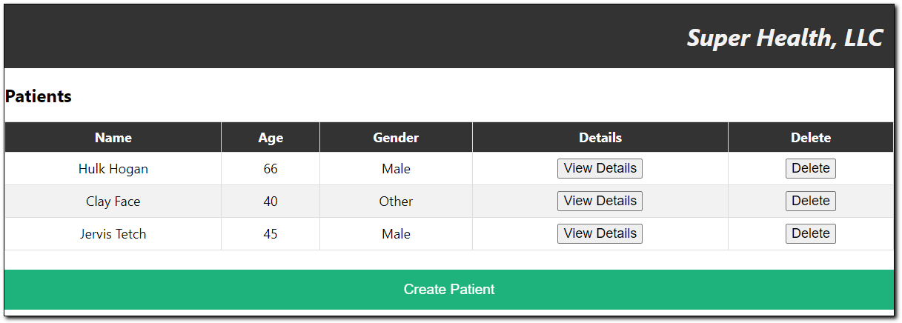
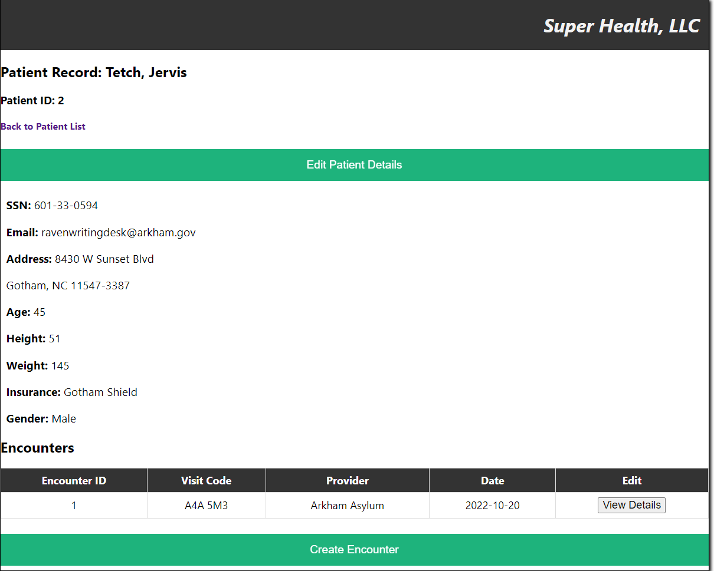

# Final Health Project Front End

## Description

A front-end React application for Super Health LLC, small regional healthcare company that operates a series of clinics.
As this application is built as a proof of concept, it allows any user to review, create and update patient information and encounters.

This application is designed to access the Health Project API, which can be accessed [https://gitlab.com/mtc-coc-se/apr-2022-cohort/jaron-owens/final-project/final-health-project-backend](here).

## Pre-requisites

* Run `npm install` in root folder to install dependencies.

### Setting Up the API

The API will be hosted on localhost:8080 and requires access to a Postgres database on port 5432.

### Starting the API with Postgres
* Ensure that your postgres database is available and configured with the following options:
  * POSTGRES_USER=postgres
  * POSTGRES_PASSWORD=root
  * PORT=5432
* The API will load a few examples of each entity (Patient, Encounter) into the database after the service starts up.

### Running the API
* Look Under src\main\java\edu\mtc\training for AppRunner.java.
* If starting in Intellij right click AppRunner, then click run.
* Can also be run subsequently by using the green play symbol in the top right corner.

## Setting Up The Front-End Application

This project was bootstrapped with [Create React App](https://github.com/facebook/create-react-app).

## Available Scripts

From the project directory, you can run:

### `npm start`

Runs the app in the development mode.\
Open [http://localhost:3000](http://localhost:3000) to view it in your browser.

The page will reload when you make changes.\
You may also see any lint errors in the console.

## Linting and Testing

In the root project folder, run `npm test`.
In the console, you should see tests running and the output should include the following details:
* A checklist of passing and failing tests for each file with a short description of the test.
* A summary of the tests run:
    * Test Suites
    * Tests
    * Time
    * Snapshots
* Other commands you can use to run all or some of the tests.

### `npm run lint`

Runs the linter script.
If you are using VSCode, you can press Alt + Shift + F at any time you are reviewing code to automatically format it.

### `npm test`

Launches the test runner in the interactive watch mode.\
To run with line coverage, 

## Usage

Once the application is running, you can navigate to [http://localhost:3000](http://localhost:3000). Upon arriving at this site, you will land on the patients screen.

## Using the Site

### Patients Screen

The Patients Screen shows an active list of all patients in the database. Click the green "Create" button at the bottom of the page to create a new patient. You can also view more details of an existing patient by clicking "View Details" next to their entry.\
You can delete a patient from the database by clicking on the "Delete" button next to them. Please be advised that you can only delete patients that do not have any associated encounters. If you do, an error message will appear.

### Patient Details Screen

Clicking on a patient will bring up more details, as well as give you the option to edit their details. It will also load all encounters for that patient, which you can view in more detail, or create a new encounter for that patient.\
Bringing up details on an encounter will allow you to edit it.